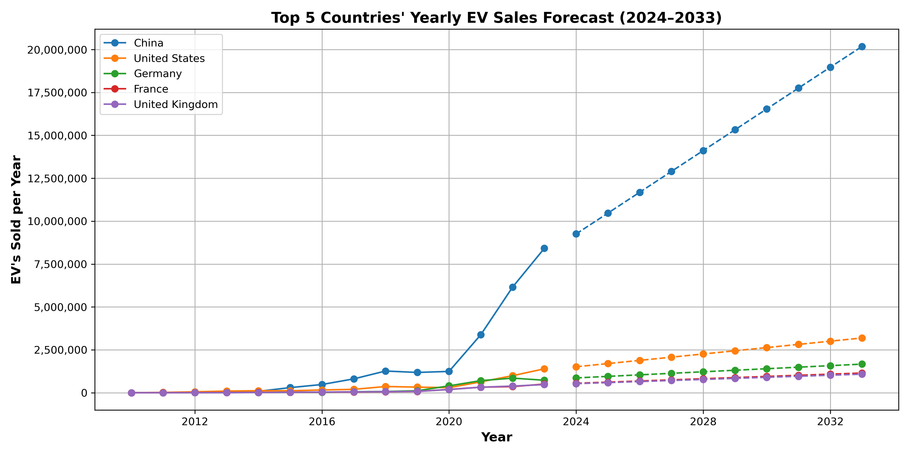

# Electric Vehicle Market Analysis & Forecasting Project

## Project Overview

In this project, I played the role of a **Data Analyst for an electric vehicle (EV) company** aiming to understand **global EV market trends and forecast future opportunities**. Using data from the **International Energy Agency (IEA)** for 2010 to 2023, I analyzed **vehicle sales by country, continent, mode, and powertrain**, then used **forecasting techniques** to predict **future EV sales volume and market share** through **2033**.

## Skills

- 🔮 Forecasting (Holt-Winters Exponential Smoothing)
- 📏 Model Fit (RMSE, held-out data testing)
- 📈 Regression Analysis (Linear regression)
- 📊 Data Visualization (Time series and categorical plots with advanced formatting)
- 🔍 Data Quality & Validation (Cleaning, transformation, and integrity checks)

## Tools

- 📚 SQL (PostgreSQL, SQLAlchemy integration)
- 🐍 Python (Pandas, Matplotlib, Scikit-learn)
- 📓 Jupyter Notebook

## Project Structure
- **ev_markets.ipynb**: Full project code and analysis with markdown explanations
- **Non-Technical Summary.pdf**: One-page, stakeholder-facing summary of key findings and strategic insights

## Key Findings (2010–2023)
- 🌍 **Global Sales**: Asia (59%), Europe (27%), North America (13%) led EV adoption.
- 🇨🇳 **China**: 23+ million vehicles sold — 55% of global total, far ahead of the US (11%).
- 🚗 **Modes**: 95% of EVs sold were cars, not buses, trucks, or vans.
- ⚡️ **Powertrains**: 71% were Battery Electric Vehicles (BEV), 29% Plug-in Hybrid (PHEV).

## Forecast Insights (2033 Projection)
- 🇨🇳 **China** projected to sell **20M+ EVs annually**, widening the gap.
- 🇺🇸 **USA**: ~3M EVs annually; Europe (Germany, France, UK): 1–2M each.
- ⚡️ **Market Share**: **67% BEVs**, **33% PHEVs** — stable shares with modest PHEV gains.

## How to Explore
1. Clone this repo and open `ev_markets.ipynb`
2. Ensure PostgreSQL is running and data is loaded (setup in notebook)
3. Run notebook cells to reproduce analysis and visuals

## File Guide
- `ev_markets.ipynb`: Full analysis (SQL + Python)
- `Non-Technical Summary.pdf`: Executive summary

**Want to learn how the EV market will evolve by 2033? Dive into the notebook or start with the summary for strategic insights!**
